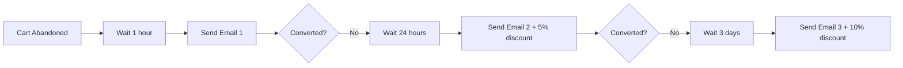
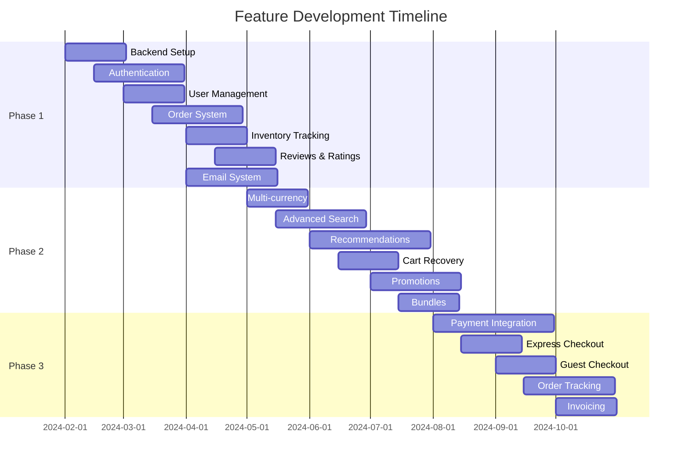

# 🚀 Feature Roadmap

## Executive Summary

This document outlines the comprehensive feature roadmap for EliteStore, organized into three phases of development. Each phase builds upon the previous one, gradually transforming the platform from a frontend-only prototype into a full-featured, enterprise-grade e-commerce solution.

---

## 📊 Current State

### Existing Features
- ✅ Product catalog with filtering/sorting
- ✅ Shopping cart management
- ✅ Wishlist functionality
- ✅ Product comparison
- ✅ Basic search
- ✅ Responsive design
- ✅ Dark mode support
- ⚠️ Mock data only (no backend)
- ⚠️ No user authentication
- ⚠️ No payment processing

---

## 🎯 Phase 1: Backend Integration & Core Infrastructure
**Timeline**: 2-3 months | **Priority**: Critical | **Team Size**: 3-4 developers

### 1.1 Backend Architecture Setup
```
┌─────────────────────────────────────┐
│           API Gateway               │
├──────┬──────┬──────┬──────┬────────┤
│ Auth │ User │Product│Order│Payment │
│ Service │ Service │Service│Service│Service│
└──────┴──────┴──────┴──────┴────────┘
        │                     │
    PostgreSQL            Redis Cache
```

#### Technologies
- **Framework**: Node.js + Express.js / NestJS
- **Database**: PostgreSQL 15+
- **Cache**: Redis 7+
- **ORM**: Prisma / TypeORM
- **API**: RESTful + GraphQL (optional)

### 1.2 Authentication & Authorization

#### Features
- **JWT-based authentication**
  - Access & refresh tokens
  - Token rotation strategy
  - Secure cookie storage
- **OAuth 2.0 integration**
  - Google Sign-In
  - Facebook Login
  - Apple Sign-In
- **Multi-factor authentication (MFA)**
  - SMS OTP
  - TOTP apps (Google Authenticator)
  - Email verification
- **Role-based access control (RBAC)**
  - Customer
  - Admin
  - Vendor (future)
  - Support Staff

#### Implementation Example
```typescript
// auth.service.ts
interface AuthService {
  register(userData: RegisterDTO): Promise<User>
  login(credentials: LoginDTO): Promise<TokenPair>
  refreshToken(token: string): Promise<TokenPair>
  logout(userId: string): Promise<void>
  verifyEmail(token: string): Promise<void>
  resetPassword(email: string): Promise<void>
}
```

### 1.3 User Management System

#### Features
- **User profiles**
  - Personal information
  - Avatar upload
  - Preferences
  - Address book
- **Account management**
  - Password change
  - Email update
  - Account deletion (GDPR)
- **Activity tracking**
  - Login history
  - Order history
  - Recently viewed products

### 1.4 Order Management System

#### Database Schema
```sql
-- Orders table
CREATE TABLE orders (
  id UUID PRIMARY KEY,
  user_id UUID REFERENCES users(id),
  status VARCHAR(50),
  total DECIMAL(10,2),
  shipping_address JSONB,
  billing_address JSONB,
  payment_method VARCHAR(50),
  created_at TIMESTAMP,
  updated_at TIMESTAMP
);

-- Order items table
CREATE TABLE order_items (
  id UUID PRIMARY KEY,
  order_id UUID REFERENCES orders(id),
  product_id UUID REFERENCES products(id),
  quantity INTEGER,
  price DECIMAL(10,2),
  discount DECIMAL(10,2)
);
```

#### Order Lifecycle
1. **Draft** → Cart items
2. **Pending** → Payment processing
3. **Confirmed** → Payment successful
4. **Processing** → Preparing shipment
5. **Shipped** → In transit
6. **Delivered** → Completed
7. **Cancelled** / **Refunded**

### 1.5 Real-time Inventory Tracking

#### Features
- Stock level management
- Low stock alerts
- Reserved inventory during checkout
- Multi-warehouse support
- Stock movement history

#### Real-time Updates
```typescript
// WebSocket events
socket.on('stock:update', (data) => {
  // Update UI in real-time
  updateProductStock(data.productId, data.newStock);
});

socket.on('stock:reserved', (data) => {
  // Show "X items in other carts" message
  showStockWarning(data.productId, data.reserved);
});
```

### 1.6 Customer Reviews & Ratings

#### Features
- **Review submission**
  - Star rating (1-5)
  - Written review
  - Photo uploads
  - Verified purchase badge
- **Review moderation**
  - Automated spam detection
  - Manual approval queue
  - Profanity filtering
- **Review interactions**
  - Helpful votes
  - Review responses
  - Sort by relevance/date/rating

### 1.7 Email Notification System

#### Transactional Emails
- Welcome email
- Email verification
- Password reset
- Order confirmation
- Shipping updates
- Review requests
- Abandoned cart reminders

#### Email Templates
```html
<!-- order-confirmation.hbs -->
<div class="email-container">
  <h1>Order Confirmed! 🎉</h1>
  <p>Hi {{customer.name}},</p>
  <p>Your order #{{order.number}} has been confirmed.</p>
  
  <div class="order-items">
    {{#each items}}
    <div class="item">
      
      <span>{{this.name}} x {{this.quantity}}</span>
      <span>${{this.total}}</span>
    </div>
    {{/each}}
  </div>
  
  <div class="order-total">
    <strong>Total: ${{order.total}}</strong>
  </div>
</div>
```

---

## 🛍️ Phase 2: Advanced E-commerce Features
**Timeline**: 3-4 months | **Priority**: High | **Team Size**: 4-5 developers

### 2.1 Multi-Currency Support

#### Features
- Real-time exchange rates (API integration)
- Automatic currency detection (GeoIP)
- Currency converter widget
- Localized pricing
- Multi-currency checkout

#### Implementation
```typescript
// currency.service.ts
interface CurrencyService {
  getExchangeRates(): Promise<ExchangeRates>
  convertPrice(amount: number, from: string, to: string): number
  detectUserCurrency(ip: string): string
  formatCurrency(amount: number, currency: string): string
}
```

### 2.2 Advanced Search System

#### Elasticsearch Integration
```json
{
  "mappings": {
    "properties": {
      "name": { "type": "text", "analyzer": "standard" },
      "description": { "type": "text" },
      "category": { "type": "keyword" },
      "price": { "type": "float" },
      "attributes": { "type": "nested" },
      "tags": { "type": "keyword" },
      "rating": { "type": "float" },
      "stock": { "type": "integer" }
    }
  }
}
```

#### Features
- **Autocomplete suggestions**
  - Product names
  - Categories
  - Brands
  - Popular searches
- **Faceted search**
  - Dynamic filters
  - Price ranges
  - Attribute filters
- **Search analytics**
  - Popular searches
  - No-results tracking
  - Click-through rates

### 2.3 Recommendation Engine

#### Algorithms
1. **Collaborative Filtering**
   - User-based recommendations
   - Item-based recommendations
2. **Content-Based Filtering**
   - Similar products
   - Category matching
3. **Hybrid Approach**
   - Combined algorithms
   - Machine learning models

#### Implementation Areas
- Homepage personalization
- Product detail page ("You might also like")
- Cart page ("Frequently bought together")
- Email campaigns
- Empty state suggestions

### 2.4 Abandoned Cart Recovery

#### Strategy


#### Features
- Automated email sequences
- Progressive discounts
- Cart restoration links
- A/B testing framework
- Performance analytics

### 2.5 Promotional Campaigns

#### Discount Types
- Percentage off
- Fixed amount off
- Buy X Get Y
- Free shipping
- Bundle deals
- Flash sales
- Member-only discounts

#### Campaign Management
```typescript
interface Campaign {
  id: string
  name: string
  type: 'percentage' | 'fixed' | 'bogo' | 'shipping'
  value: number
  conditions: {
    minPurchase?: number
    validProducts?: string[]
    validCategories?: string[]
    userGroups?: string[]
  }
  schedule: {
    startDate: Date
    endDate: Date
    timezone: string
  }
  limits: {
    totalUses?: number
    usesPerCustomer?: number
  }
}
```

### 2.6 Product Bundles & Cross-selling

#### Bundle Types
- **Fixed bundles**: Pre-defined product sets
- **Mix & match**: Choose X from Y products
- **Volume discounts**: Bulk purchase savings
- **Accessory bundles**: Main product + accessories

#### Cross-selling Strategies
- "Complete the look" (fashion)
- "Essential accessories" (electronics)
- "Customers also bought"
- "Better together" savings

### 2.7 Size Guides & Fitting Tools

#### Features
- Interactive size charts
- Size recommendation algorithm
- Virtual try-on (AR)
- Fit predictor based on past purchases
- Brand-specific conversions
- Return rate reduction

---

## 💳 Phase 3: Payment, Checkout & Advanced Features
**Timeline**: 2-3 months | **Priority**: High | **Team Size**: 3-4 developers

### 3.1 Payment Gateway Integration

#### Supported Gateways
1. **Stripe**
   - Cards (Visa, Mastercard, Amex)
   - Digital wallets (Apple Pay, Google Pay)
   - Bank transfers (ACH, SEPA)
   - Buy now, pay later (Klarna, Afterpay)

2. **PayPal**
   - PayPal Checkout
   - PayPal Credit
   - Venmo (US)

3. **Regional Options**
   - Razorpay (India)
   - Alipay (China)
   - MercadoPago (Latin America)

#### Implementation
```typescript
// payment.service.ts
interface PaymentService {
  createPaymentIntent(amount: number, currency: string): Promise<PaymentIntent>
  processPayment(paymentMethod: string, intent: string): Promise<PaymentResult>
  refundPayment(paymentId: string, amount?: number): Promise<RefundResult>
  getPaymentMethods(userId: string): Promise<PaymentMethod[]>
  savePaymentMethod(userId: string, method: PaymentMethod): Promise<void>
}
```

### 3.2 Express Checkout Options

#### One-Click Checkout
- Saved payment methods
- Default shipping address
- Skip cart page
- Instant purchase

#### Social Commerce Checkout
- Buy from Instagram
- Facebook Shop
- Pinterest Shopping
- TikTok Shopping

### 3.3 Guest Checkout

#### Features
- No registration required
- Email-based order tracking
- Option to create account post-purchase
- Simplified checkout flow
- Guest order history

### 3.4 Advanced Address Management

#### Features
- **Address validation**
  - Google Places API
  - Address standardization
  - Postal code verification
- **Multiple addresses**
  - Home, work, others
  - Default selections
  - Address book management
- **Smart suggestions**
  - Previous addresses
  - Autofill from profile
  - Geolocation detection

### 3.5 Order Tracking System

#### Tracking Features
```typescript
interface OrderTracking {
  orderId: string
  trackingNumber: string
  carrier: 'USPS' | 'FedEx' | 'UPS' | 'DHL'
  status: TrackingStatus
  events: TrackingEvent[]
  estimatedDelivery: Date
  proofOfDelivery?: {
    signature: string
    photo: string
    timestamp: Date
  }
}
```

#### Real-time Updates
- Push notifications
- SMS updates
- Email notifications
- In-app tracking
- Carrier API integration

### 3.6 Invoice Generation

#### Invoice Features
- PDF generation
- Custom templates
- Multi-language support
- Tax calculations
- Bulk download
- Email delivery
- API access

---

## 📈 Success Metrics & KPIs

### Phase 1 Metrics
- User registration rate: >60%
- Email verification rate: >80%
- API response time: <200ms
- System uptime: >99.9%

### Phase 2 Metrics
- Search conversion rate: >30%
- Cart abandonment recovery: >15%
- Recommendation CTR: >10%
- Discount code usage: >25%

### Phase 3 Metrics
- Checkout completion rate: >70%
- Payment success rate: >95%
- Guest checkout usage: >40%
- Mobile payment adoption: >30%

---

## 🔄 Implementation Timeline



---

## 🚧 Risk Mitigation

### Technical Risks
- **Payment failures**: Implement retry logic and fallback gateways
- **Scalability issues**: Use horizontal scaling and caching
- **Security breaches**: Regular audits and penetration testing
- **Data loss**: Automated backups and disaster recovery

### Business Risks
- **Low adoption**: Progressive rollout with beta testing
- **Feature creep**: Strict prioritization and MVP approach
- **Budget overrun**: Phased development with clear milestones
- **Competition**: Rapid iteration and unique value props

---

## 🎯 Next Steps

1. **Stakeholder approval** for Phase 1
2. **Technical architecture** detailed design
3. **Development team** assembly
4. **Infrastructure setup** (AWS/GCP/Azure)
5. **Sprint planning** for first milestone
6. **Beta testing program** recruitment

---

<p align="center">
  <strong>Document Version:</strong> 1.0.0<br>
  <strong>Last Updated:</strong> January 2024<br>
  <strong>Approved By:</strong> [Pending]
</p>
